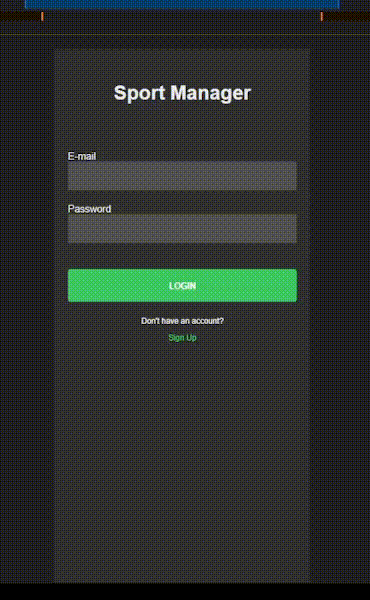
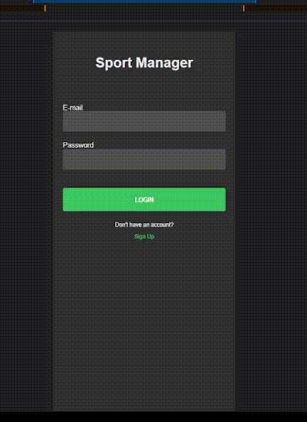

# Sport Manager

##  MERN application 

## The App

<div alignItem="end" justfyContent="spaceBetween"> 
  
</div> 

## Signup

<div alignItem="end" justfyContent="spaceBetween"> 
  
</div>

## Validation Signin

<div alignItem="end" justfyContent="spaceBetween"> 
  
</div>

## Validation Signup

<div alignItem="end" justfyContent="spaceBetween"> 
  
</div>

## Responsiveness

<div alignItem="end" justfyContent="spaceBetween"> 
  
</div>

<div alignItem="end" justfyContent="spaceBetween"> 
  
</div>

## Getting Started

Install the dependencies and run the development server

### /client

```bash
yarn install
yarn start
```

### /service
#### Create a [MongoDB](https://mongodb.com/cloud/atlas) DB.

```bash
yarn install
yarn start
```

### Technologies

##### - [ReactJS](https://reactjs.org/)
##### - [Node](https://nodejs.org/en/)
##### - [Redux/Toolkit](https://redux-toolkit.js.org/)
##### - [Recharts](http://recharts.org/)
##### - [Styled Components](https://styled-components.com/)
##### - [Axios](https://axios-http.com/ptbr/docs/intro)
